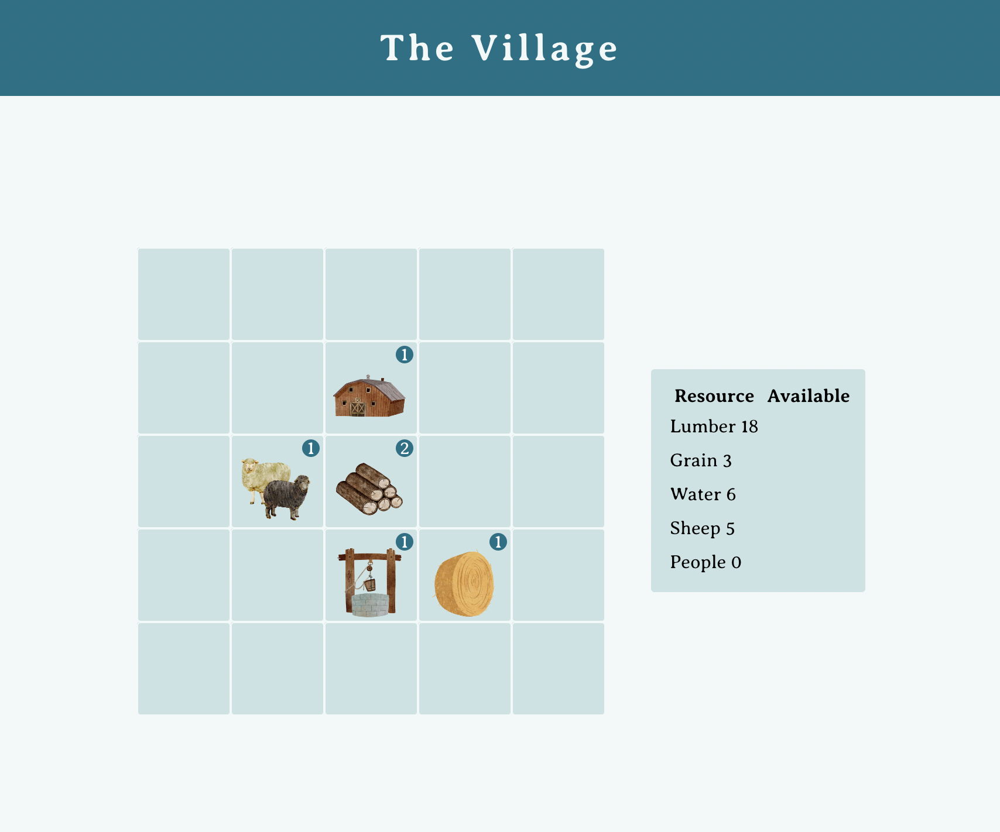
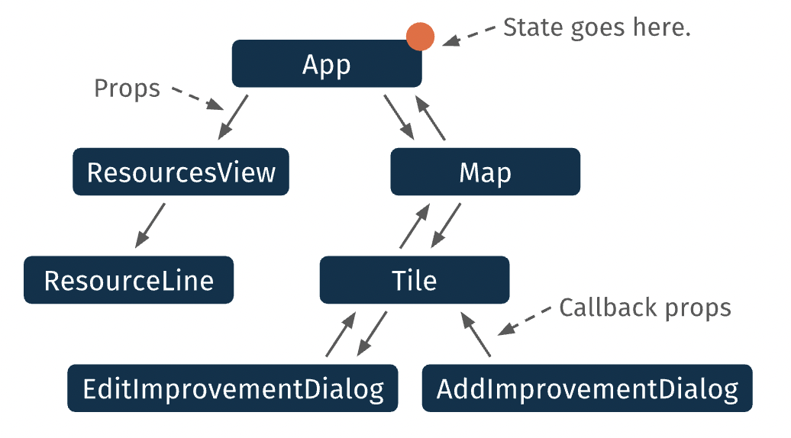

# The Village

Village Sim is an interactive simulation game where your goal is to survive, and then thrive! Strategically grow your village and add improvements by obtaining resources.

## Screenshot

## Task

Create a React application that allows the user to build a village by placing improvements and consuming resources.

## Functionality

The diagram below displays the basic structure of the Village Simulator app. Kate, Desiree, and Justin worked together on many functions within the app to ensure a smooth user experience. They each had major individual contributions in the following components:

Justin Green: AddImprovementDialog - displaying each image on the corresponding tile and updating the resources available accurately to the user. In Map.tsx, Justin's contributions made tiles visible within the map.

Kate Grutter: Developed the structure of many components, including ImprovementCosts.tsx Map.tsx, and Tile.tsx. These contributions were integral in allowing communication between parent and child components. Kate also imported SweetAlerts to alert the user when they don't have enough resources to complete an action.

Desiree Cushing: Contributed the Upgrade and Downgrade functions in EditImprovementDialog.tsx. Added Handle Upgrade/Downgrade in Map.tsx to display the improvement's level to the user within a circle div - the communication between each tile and the dialog needed to be connected within Map.tsx.

## Group Members
Developed by [Kate Grutter](https://github.com/KateGrutter), [Justin Green](https://github.com/jgreener6), and [Desiree Cushing](https://github.com/descush)

## Technology

&nbsp;
&nbsp;
